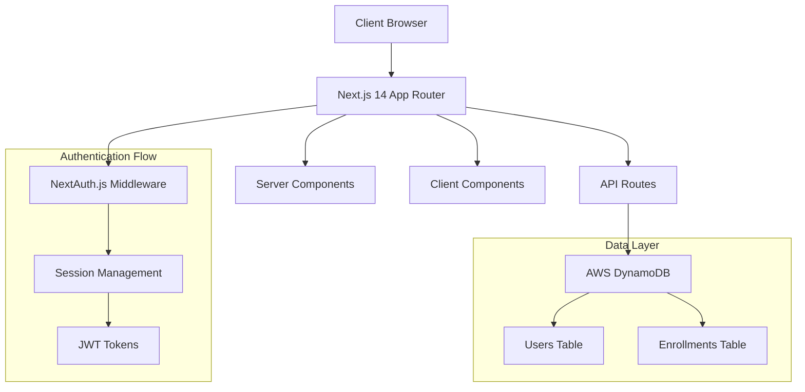

# Design Document

## Overview

The student class registration system is a full-stack web application built with Next.js 14 App Router, providing secure authentication and class enrollment functionality. The system uses AWS DynamoDB for data persistence, NextAuth.js for authentication, and Tailwind CSS for responsive UI design.

## Architecture

### High-Level Architecture



### Technology Stack

- **Frontend**: Next.js 14 with App Router, React Server Components
- **Styling**: Tailwind CSS for responsive design
- **Authentication**: NextAuth.js with JWT strategy
- **Database**: AWS DynamoDB with AWS SDK v3
- **Type Safety**: TypeScript throughout the application
- **Validation**: Zod for runtime type validation
- **Password Hashing**: bcryptjs for secure password storage

## Components and Interfaces

### Core Components Structure

```
/app
├── layout.tsx                 # Root layout with providers
├── page.tsx                   # Landing page
├── (auth)/
│   ├── login/
│   │   └── page.tsx          # Login form
│   └── register/
│       └── page.tsx          # Registration form
├── dashboard/
│   └── page.tsx              # Student dashboard
├── classes/
│   ├── page.tsx              # Browse classes
│   └── [id]/
│       └── page.tsx          # Class details
└── api/
    ├── auth/
    │   └── [...nextauth]/
    │       └── route.ts      # NextAuth.js configuration
    ├── register/
    │   └── route.ts          # User registration endpoint
    └── enrollments/
        └── route.ts          # Enrollment management

/components
├── ui/                       # Reusable UI components
├── auth/                     # Authentication components
├── classes/                  # Class-related components
└── layout/                   # Layout components

/lib
├── auth.ts                   # NextAuth.js configuration
├── db.ts                     # DynamoDB client setup
├── validations.ts            # Zod schemas
└── utils.ts                  # Utility functions

/types
└── index.ts                  # TypeScript type definitions
```

### Authentication Components

#### NextAuth.js Configuration
- **Provider**: Credentials provider for email/password authentication
- **Session Strategy**: JWT-based sessions for stateless authentication
- **Callbacks**: Custom JWT and session callbacks for user data management
- **Pages**: Custom login and registration pages

#### Session Management
- Server-side session verification using NextAuth.js
- Protected routes with middleware
- Automatic redirect for unauthenticated users

### UI Components

#### Layout Components
- **Header**: Navigation with authentication status
- **Sidebar**: Dashboard navigation (authenticated users)
- **Footer**: Application footer with links

#### Form Components
- **LoginForm**: Email/password authentication
- **RegisterForm**: User registration with validation
- **EnrollmentButton**: Class enrollment/unenrollment

#### Display Components
- **ClassCard**: Class information display
- **EnrollmentList**: Student's enrolled classes
- **ClassDetails**: Detailed class information

## Data Models

### DynamoDB Table Structures

#### Users Table
```typescript
interface User {
  id: string;                 // Partition Key (UUID)
  email: string;              // Global Secondary Index
  name: string;
  studentId: string;          // Unique student identifier
  passwordHash: string;       // bcryptjs hashed password
  createdAt: string;          // ISO timestamp
  updatedAt: string;          // ISO timestamp
}
```

#### Classes Table (Static Data)
```typescript
interface Class {
  id: string;                 // Partition Key
  name: string;
  description: string;
  instructor: string;
  schedule: string;
  capacity: number;
  currentEnrollment: number;  // Updated via enrollments
  createdAt: string;
  updatedAt: string;
}
```

#### Enrollments Table
```typescript
interface Enrollment {
  id: string;                 // Partition Key (UUID)
  userId: string;             // Global Secondary Index
  classId: string;            // Global Secondary Index
  enrolledAt: string;         // ISO timestamp
  status: 'active' | 'dropped';
}
```

### DynamoDB Access Patterns

1. **Get User by Email**: GSI on email field
2. **Get User Enrollments**: GSI on userId in Enrollments table
3. **Get Class Enrollments**: GSI on classId in Enrollments table
4. **Check Enrollment Status**: Query by userId and classId

### Zod Validation Schemas

```typescript
// User registration validation
const RegisterSchema = z.object({
  name: z.string().min(2).max(50),
  email: z.string().email(),
  studentId: z.string().min(5).max(20),
  password: z.string().min(8).max(100)
});

// Login validation
const LoginSchema = z.object({
  email: z.string().email(),
  password: z.string().min(1)
});

// Enrollment validation
const EnrollmentSchema = z.object({
  classId: z.string().uuid(),
  action: z.enum(['enroll', 'unenroll'])
});
```

## Error Handling

### Client-Side Error Handling
- Form validation errors with user-friendly messages
- Network error handling with retry mechanisms
- Loading states for async operations
- Toast notifications for success/error feedback

### Server-Side Error Handling
- API route error responses with appropriate HTTP status codes
- Database connection error handling
- Authentication error handling
- Input validation error responses

### Error Response Format
```typescript
interface ErrorResponse {
  error: string;
  message: string;
  statusCode: number;
  timestamp: string;
}
```

## Testing Strategy

### Unit Testing
- Component testing with React Testing Library
- API route testing with Jest
- Utility function testing
- Validation schema testing

### Integration Testing
- Authentication flow testing
- Database operation testing
- End-to-end user workflows

### Test Structure
```
/__tests__
├── components/              # Component tests
├── api/                     # API route tests
├── lib/                     # Utility tests
└── integration/             # Integration tests
```

## Security Considerations

### Authentication Security
- Password hashing with bcryptjs (salt rounds: 12)
- JWT token expiration (24 hours)
- Secure HTTP-only cookies for session storage
- CSRF protection via NextAuth.js

### Data Security
- Input validation on all user inputs
- SQL injection prevention (DynamoDB NoSQL)
- Environment variable protection for secrets
- Rate limiting on authentication endpoints

### Authorization
- Route protection middleware
- Server-side session verification
- Role-based access (future enhancement)

## Performance Optimizations

### Next.js Optimizations
- Server Components for initial page loads
- Client Components only where interactivity is needed
- Automatic code splitting
- Image optimization with next/image

### Database Optimizations
- DynamoDB Global Secondary Indexes for efficient queries
- Batch operations for multiple enrollments
- Connection pooling with AWS SDK v3
- Caching strategies for static class data

### UI/UX Optimizations
- Responsive design with Tailwind CSS
- Loading states and skeleton screens
- Optimistic UI updates for enrollments
- Progressive enhancement

## Deployment Considerations

### Environment Configuration
- Separate environments (development, staging, production)
- Environment-specific DynamoDB tables
- Secure secret management
- CORS configuration for API routes

### AWS Infrastructure
- DynamoDB tables with appropriate read/write capacity
- IAM roles and policies for DynamoDB access
- CloudWatch monitoring and logging
- Backup and recovery strategies

### Monitoring and Logging
- Application performance monitoring
- Error tracking and alerting
- User analytics and usage metrics
- Database performance monitoring